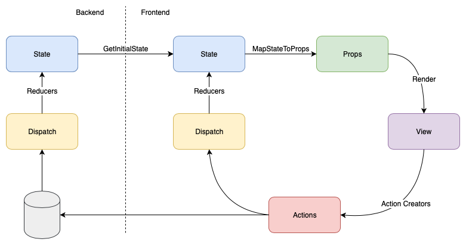

# reSolve: A Redux-Inspired Backend

TL;DR: I'm not going to run Redux on the server. If you are using React with Redux and favor a functional approach to state management, then this article will show you how to extend its ideas to the backend.

## React+Redux benefits

The combination of React and Redux represents a simple but powerful concept  for a unidirectional flow of data:


React+Redux data flow

The state is the starting point. A view is a function of the state. A React component can literally be a function of its properties, which makes it a function of the state. All user interactions with a view are represented by sequences or streams of Redux actions. Actions are processed by functions (reducers) to calculate new states.

React+Redux enables functional programming with immutable state and pure functions. It makes code predictable and easy to test and reason about. It lets you see the sequence of events that resulted in a particular state for your application. It enables time traveling:  with the Redux dev tools, you can inspect your application state at any point in time.

## How to extend these benefits to the Backend

Wouldn't it be useful for the whole application system to have these properties, not just the UI part? Is it possible to include the backend in this functional circle? Yes, it is! We can send all actions to the server and store them. Later, we can load all the actions and send them to a client where they will be reduced into an initial state. Or we can reduce them on the server and create the initial state:


React+Redux with a backend in the loop

Look at your React+Redux app: what is the source of truth - the state or the actions? In a Redux app,  actions are the source of truth and state can be calculated from the actions by the reducers.

In the same way, our hypothetical backend has actions as its source of truth. The state of the system is a function of all actions executed by users since the beginning of time. So, by sending all actions to the backend we can calculate the state of an entire system there.

## Making redux-inspired backend real

You might say it can't really be that simple. Real backends are complex. What about multi-user access, business logic, domain models, transactions?

Let's examine all these concerns and see what can we do to address them.

### Don't send everything to the backend

The state of a complete system is not the same thing as the state of an end-user UI. For example, shen you navigate to your shopping cart screen, you are not changing the state of the system, you are changing the local state of the current session. This means that not every Redux action should go to the server. We only need to send those actions that change the state of the system and should be reflected elsewhere - for example, the action of putting an item into a shopping cart.

### Actions: commands or events?

Your server should not blindly trust any action sent by a client. The client code is not allowed to inform the backend that the system state has changed. Instead, client code should send an intent to change the system state. The backend will use business logic to decide whether and how a change will be applied.

Let's call an intent to change something a _Command_. Business logic will process Commands and generate a fact, a record saying that the system has changed its state. Let's call this record an _Event_.

A Redux action is a mix of a Command (an intent to change state) and an Event (a fact, used to calculate a new state). Although some argue that actions should be used strictly as Events, for example in [this article](https://hackernoon.com/dispatch-redux-actions-as-events-not-commands-4de8a92b1ea5), and [this discussion](https://github.com/reduxjs/redux/issues/351).

What is the "business logic" that should handle a Command? It is a function that accepts a Command and produces an Event according to business rules. I'll use a Domain Driven Design (DDD) approach, so we need a domain object that is capable of executing a Command as a transaction. Usually, it is not a single object but a collection of related objects called a DDD _Aggregate_.


Handling a command

Just like for Redux, the state of this Aggregate is a function of its previous Events, calculated by reducers.

A client sends a Command to an Aggregate. The Aggregate uses its own state and logic to decide whether the Command can be executed and which Events to produce. The Events can then be stored in an Event Store and sent to reducers to update system state.

### There's more than one stream of actions

Redux represents a single stream of actions and events. In a multi-user application, you will have hundreds or thousands of streams running in parallel - at least one per client.

This results in a consistency problem. How do you execute a Command based on system state when that state is constantly being changed by other Events? The Domain Aggregate concept from DDD  will help us again here. Aggregate (or Aggregate root) represents business objects (part of the system state) that can be changed by a single command. An Aggregate should be contained within transaction/consistency boundaries:

- Consistency boundaries: When Command execution begins, the state of the Aggregate is consistent. All previously generated Events have been applied to it.

- Transaction boundaries: Command execution is transactional. No other Command can be executed for the same Aggregate while a previous Command is still being executed, or while resulting Events and state changes are still being processed.

How to achieve these properties? There are many aggregates in the system. Each command is sent to a specific aggregate. Aggregate executes a Commands and produces changes in the system, represented by Events. These Events are applied to the Aggregate immediately. At any moment it represents a part of the latest known state of the system.

It should not be possible to have several instances of the same aggregate performing different commands. This can be achieved by having a command queue, or by optimistic or pessimistic locks in the event store.

### Queries and Read Models

To close the data flow circle back to the client, Events need to influence the presentation of the system state on clients. In some cases, Events can be sent directly to clients to update Redux state through reducers. More commonly, clients don't store or show the complete system state. That full system state usually resides on the backend, and parts of it are sent to clients in response to requests. We'll call those requests _Queries_, and the data stores for system state - _Read Models_.

How do we obtain the current state of the system? The same way as any Redux app :  using reducers. We start with an initial system state (which is usually empty or non-existent), and we call reducers with every Event since the beginning of time.

The current system state is represented by Read Models. These Read Models are calculated from the stream of Events by reducers.


Closing the backend data loop

If a Read Model is persistent, it requires functions that mutate state. It is technically not correct to call these functions Reducers. They are usually called Projections since they "project" an Event onto an existing Read Model. Note that only projection function can mutate state. These functions are called sequentially, so there is no shared mutable state.

With a Read Model in place, a client can send a Query to the backend. A Query Resolver function can respond to a query by working with a Read Model.

## Let's see our result

It's interesting to find out where we got with our mental leaps. In this diagram of the resulting architecture, you can see two design patterns - Event Sourcing and CQRS:


Complete data flow overview

### Event Sourcing

We store Events (as a primary source of truth) and calculate system state from them. This approach is called Event Sourcing. A great way to learn it is to read a [Martin Fowler's definition](https://martinfowler.com/eaaDev/EventSourcing.html) and watch a [classic introduction video from Greg Young](https://www.youtube.com/watch?v=8JKjvY4etTY).

### CQRS

In our architecture, the only way to change the state of the system is to issue a Command. We use Queries to observe the state of the system. A Command does not return system state, and a Query does not change it. This pattern is called Command-Query Separation (CQS).

DDD Aggregates represent the part of the system state that is sufficient to process a Command. The Command "side" doesn’t need to talk directly to the "side" where Queries and Read Models live. All it has to do is emit Events to an Event Bus. This leads us to the [Command-Query Responsibility Segregation (CQRS) pattern](https://martinfowler.com/bliki/CQRS.html). Our system can be physically separated into a "Write Side" that emit events and a "Read Side" that consumes events and projects them onto Read Models.

The CQRS pattern lets you scale the Write Side and the Read Side separately. After all, in most systems Queries occur way more frequently than Commands. You can optimize your Read Side for query performance, and the Write Side for command execution performance.

## CQRS+ES Properties

CQRS and Event Sourcing naturally fit together.
Let's examine the properties of a CQRS+ES architecture:

### Functional Programming-Friendly: Easy to test and reason about

Similar to React+Redux, a code in a CQRS+ES system is functional-friendly. There's a one-way data flow, and Command, Event and Query are plain data structures or data transfer objects. Command handlers and reducers are pure functions without side effects. Such functions are easy to test without the need to mock anything.

### Time Traveling

Just like with React+Redux, it is possible to restore system state for any point in time to reproduce problems and bugs.

### Reactive Applications

Events are the main data medium in this architecture and it is easy to react to system state changes as they occur. You can even send certain Events to interested clients via web sockets to reactively update a UI without polling the backend.

### Async Operations

Command execution is complete when an event is produced. Subsequent Read Model updates are executed asynchronously. As a result, you can build more responsive applications.

### System that is easy to modify, refactor and evolve

In a traditional database application that uses ORM, it is very hard to change the domain model or database schema once it is filled with data. Usually, you need to create a new database, migrate data to it and then switch to new code. In event sourced systems, we don't store state, we calculate it. So when we need to change the structures of the state or Read Models, we can simply recalculate the data. We can even run old and new versions of Read Models in parallel.

### Complete detailed audit log

Most large systems require some form of an audit log. It is often incomplete, and you only find out what's missing when it is too late and data is lost or you can't find what you need in an audit trail.

Most database systems keep transaction logs internally, but these logs are storage-specific, not business-specific (`UPDATE orders SET status = 3` vs _Order Paid_).

Event sourced systems provide you with business-specific audit logs, guaranteed 100% to be complete. These logs can be used to fully restore system state and analyze any sequence of events.

### Append-only database with a fixed structure

The Event Store is append-only. It stores Events using a fixed structure: several system fields and a free-form payload. This makes Event Store implementations straight-forward and independent from any particular domain design. The append-only nature makes it easy to replicate and synchronize Event data.

### No shared mutable state

> "Mutability is OK, sharing is nice, shared mutability is devil's work."

[A shared mutable state is bad](https://stackoverflow.com/questions/44219903/why-is-shared-mutability-bad). CQRS+ES lets you avoid this problem as much as possible.

### No data loss

When you update or delete data in traditional CRUD applications, you lose the old version data, or the old version of the data, unless you keep an audit log. Unless you anticipate certain events, your audit log may not contain information that turns out to be necessary later.

For example, if the action of removing an item from a shopping cart is simply a deletion, you won't be able to answer the question "how many customers have removed items from their baskets?" later on. Your application needs to be specially prepared to log details about item removal from shopping baskets.

On the other hand, an Event Store is append-only. Nothing is deleted. As long as an operation is captured in an Event, the data is forever available to analyze.

In the above example, you could create a new Read Model that counts users who triggered `ITEM_REMOVED` Shopping Basket Events.

### Distributed scalable applications

Applications are easy to distribute and scale. The Write Side can be scaled independently from the Read Side. With an Event Bus, both sides can span many instances.

It is easy to split the application system into microservices that work with the Event Bus. Command handlers and Event consumers can be implemented by different teams and even in different languages.

### Serverless-friendly.

Command handlers and projection functions can be implemented as cloud functions. Read Models can be stored in cloud databases. The Event Bus can use queue or stream services. The Event stream can be processed by stream analysis tools. Since there is no need for shared mutable domain objects, we can deploy an application system on serverless platforms such as AWS Lambda or Azure Functions.

### Eventual Consistency

Changes made by users are not immediately propagated. This architecture favors availability over consistency. This is something we need to keep in mind while developing CQRS+ES applications when migrating from a CRUD mindset. Here is a [good article that explains how CQRS+ES systems are different](https://medium.com/@hugo.oliveira.rocha/what-they-dont-tell-you-about-event-sourcing-6afc23c69e9a).

A Command does not return new data, and its result may be not available immediately on the Read Side. So we need to use techniques like [delays and optimistic UI updates](http://danielwhittaker.me/2014/10/27/4-ways-handle-eventual-consistency-ui/), correlation IDs or API handlers (which issue Commands and a follow-up Query in one call) to adapt the UI to the asynchronous nature of the system.

### Events represent the domain design

In traditional application architecture, data and object models are the core of domain design. In event sourced system we need to carefully design Events to be the "source of truth". We need to approach domain modeling from a different perspective, using emerging techniques like [Event Storming](https://www.thoughtworks.com/radar/techniques/event-storming).

Since Events are immutable, evolving the system of Events is an important skill which deserves its own book. [Here is one from Greg Young](https://leanpub.com/esversioning/read).

Fortunately, identifying events in the domain is easier than designing a domain model. All we need to do is to capture the fact represented by an event ("Ticket #1234 has been closed"). We can decide later about the meanings and consequences attached to the Event.

### Even more reactive applications with Node.js and React+Redux

Building a Read Model from the stream of Events using a reducer is very similar to building app state on the client with reducers from the stream of actions.

Events can be sent to the client as actions and be processed immediately by reducers. This means that system changes can be reflected immediately, without the need to re-query the backend. Node.js lets us use the same language for clients and backend so we can share reducer code between server and client.

## A way to develop a modern application

I have always been fascinated by the idea of being able to quickly develop a business application. "In the end, it is just lists and forms". At DevExpress we created a framework called XAF that let users quickly create a typical business app (as of 2005). You know, database in the center, ORM, fat client desktop app. XAF made it very easy to get started, allowed you to care less about the database and just code your business objects in the familiar OOP way.

The only big technical issue that wasn't solved by the architectural concepts used in XAF - and many other applications created around that time - was that of maintaining and changing data structures over time. If you change your domain model, you need to migrate data to a new DB schema or carefully adjust ORM mapping rules. In both cases, things get difficult very quickly.

Event sourcing doesn't have such problems. With little effort, you can even run old and new domain models in parallel.

Yes, it requires a different approach to business analysis and application design. You'll need some time to adapt to the way of thinking, but I believe the results are worth the time. I think more and more modern apps are going to be event sourced since they are much more adaptable to changes in the long run.

## Sample code using reSolve framework

[reSolve](https://github.com/reimagined/resolve) is a CQRS+ES framework for Node.js. With it, you can focus on Aggregates, Commands, Events, Queries, Read Models, View Models and care less about plumbing infrastructure.

It is pretty easy to start - just use the `create-resolve-app` CLI to create an empty app:

```sh
$ npx create-resolve-app myApp
```

If you want your app to include an example project, use the `-e` switch:

```sh
$ npx create-resolve-app myApp -e shopping-list
```

I'll show you what type of code you are expected to write for reSolve. Check the [reSolve Shopping List tutorial](https://github.com/reimagined/resolve/tree/docs/add-tutorial/docs/tutorial) for a complete explanation.

### Write Side

You define your domain aggregates with Command handlers that return an Event each:

```js
    createShoppingList: (state, { payload: { name } }) => {
        if (state.createdAt) throw new Error('Shopping List already exists')
        if (!name) throw new Error('name is required')

        return {
            type: SHOPPING_LIST_CREATED,
            payload: { name },
        }
    },
    renameShoppingList: (state, { payload: { name } }) => {
        if (!state.createdAt) throw new Error('Shopping List does not exist')
        if (!name) throw new Error('name is required')

        return {
            type: SHOPPING_LIST_RENAMED,
            payload: { name },
        }
    },
    removeShoppingList: state => {
        if (!state.createdAt) throw new Error('Shopping List does not exist')

        return {
            type: SHOPPING_LIST_REMOVED,
        }
    },
```

and reducers to calculate Aggregate state:

```js
    Init: () => ({}),
    [SHOPPING_LIST_CREATED]: (state, { timestamp }) => ({
        ...state,
        createdAt: timestamp,
    }),
    [SHOPPING_LIST_REMOVED]: () => ({}),
```

### Read Side

Then you can define your Read Models and projection functions. reSolve provides a unified database interface for Read Models.

```js
    Init: async store => {
        await store.defineTable('ShoppingLists', {
            indexes: {
                id: 'string',
            },
            fields: ['createdAt', 'name'],
        })
    },

    [SHOPPING_LIST_CREATED]: async (
        store,
        { aggregateId, timestamp, payload: { name } }
    ) => {
        const shoppingList = {
            id: aggregateId,
            name,
            createdAt: timestamp,
        }

        await store.insert('ShoppingLists', shoppingList)
    },

    [SHOPPING_LIST_REMOVED]: async (store, { aggregateId }) => {
        await store.delete('ShoppingLists', { id: aggregateId })
    },

    [SHOPPING_LIST_RENAMED]: async (
        store,
        { aggregateId, payload: { name } }
    ) => {
        await store.update(
            'ShoppingLists',
            { id: aggregateId },
            { $set: { name } }
        )
    },
```

Finally, a query resolver (this one returns all shopping lists):

```js
    all: async store => {
        return await store.find('ShoppingLists', {}, null, { createdAt: 1 })
    },
```

This is all you need to do to define a backend. Run your app and now you can send Commands:

```sh
$ curl -i http://localhost:3000/api/commands/ \
--header "Content-Type: application/json" \
--data '
{
    "aggregateName": "ShoppingList",
    "aggregateId": "12345",
    "type": "createShoppingList",
    "payload": {
        "name": "My new shopping list"
    }
}
'

HTTP/1.1 200 OK
...
OK
```

Now you can send a query:

```sh
$ curl -i -g -X GET 'http://localhost:3000/api/query/ShoppingLists/all'
HTTP/1.1 200 OK
...
[
  {
    "id": "12345",
    "name": "My new shopping list",
    "createdAt": 1542807563827
  }
]
```

The `resolve-redux` package provides higher-order components (HOC) that helps you connect Read Models to components. Aggregate commands are available as Redux actions in `aggregateActions`:

```js
//...
import { connectReadModel } from "resolve-redux";
//...
class MyLists extends React.PureComponent {
  render() {
    const { lists, createShoppingList, removeShoppingList } = this.props;

    return (
      <div className="example-wrapper">
        <ShoppingLists lists={lists} removeShoppingList={removeShoppingList} />
        <ShoppingListCreator
          lists={lists}
          createShoppingList={createShoppingList}
        />
      </div>
    );
  }
}

export const mapStateToOptions = () => ({
  readModelName: "ShoppingLists",
  resolverName: "all",
  resolverArgs: {}
});

export const mapStateToProps = state => ({
  lists: state.optimisticShoppingLists || []
});

export const mapDispatchToProps = (dispatch, { aggregateActions }) =>
  bindActionCreators(aggregateActions, dispatch);

export default connectReadModel(mapStateToOptions)(
  connect(
    mapStateToProps,
    mapDispatchToProps
  )(MyLists)
);
```

The reSolve view model is a special kind of Read Model that doesn't need a persistent storage.
It uses pure Redux reducers to calculate its state, so it can live on a client as a part of a Redux store and be updated reactively.

If you know Redux, you can use reSolve to create a modern reactive backend using the same language and concepts.

## Conclusion

State management is hard. Redux simplifies UI state management. Event Sourcing and CQRS are built on similar ideas to simplify system state management for backends.

One-way data flow, functional stateless code, an immutable write-only Event Store and calculated Read Models let you create simpler applications that are easier to maintain and change.

With the [reSolve framework](https://github.com/reimagined/resolve) you can use familiar functional JavaScript to create a robust reactive backend.

## Further reading

- [Event Sourcing](https://martinfowler.com/eaaDev/EventSourcing.html). Martin Fowler's definition
- [Event Sourcing](https://www.youtube.com/watch?v=8JKjvY4etTY). An introduction video from Greg Young
- [Command-Query Responsibility Segregation (CQRS) pattern](https://martinfowler.com/bliki/CQRS.html). Martin Fowler's definition
- [Daniel Whittaker blog](http://danielwhittaker.me)
- [Event Sourcing Basics](https://eventstore.org/docs/event-sourcing-basics/) in Event Store docs
- [Clarified CQRS](http://udidahan.com/2009/12/09/clarified-cqrs/) by Udi Dahan
- [1 Year of Event Sourcing and CQRS](https://hackernoon.com/1-year-of-event-sourcing-and-cqrs-fb9033ccd1c6) by Teiva Harsanyi
